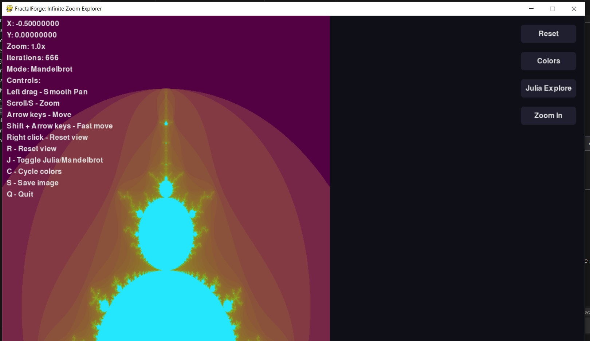
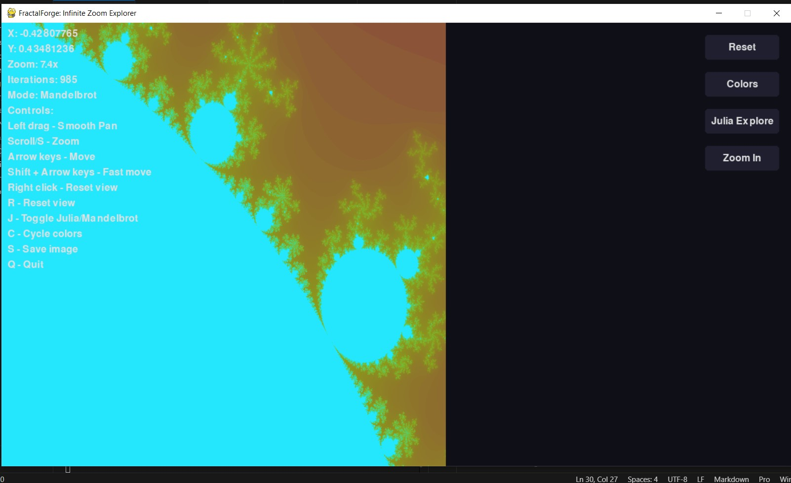
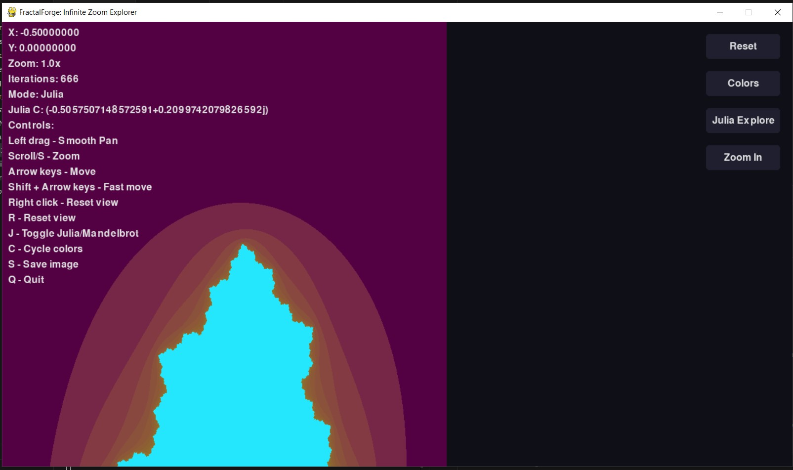

# FractalForge: Interactive Fractal Explorer

## Overview
FractalForge is an advanced, interactive fractal visualization application that allows users to explore Mandelbrot and Julia sets with real-time rendering and multiple features.

## Screenshots




## Features
- Interactive Fractal Exploration
- Mandelbrot and Julia Set Rendering
- Smooth Zooming and Panning
- Multiple Colormap Options
- Julia Set Parameter Exploration
- High-Precision Rendering

## Prerequisites
- Python 3.8+
- Pygame
- NumPy
- Matplotlib
- Numba

## Installation
1. Clone the repository
```bash
git clone https://github.com/Razee4315/FractalForge.git
cd FractalForge
```

2. Install dependencies
```bash
pip install -r requirements.txt
```

## Usage
Run the application:
```bash
python main.py
```

### Controls
- Left Drag: Pan
- Scroll/S: Zoom
- Arrow Keys: Move
- R: Reset View
- J: Toggle Julia/Mandelbrot
- C: Cycle Colors
- S: Save Image
- Q: Quit

## Contributing
Contributions are welcome! Please feel free to submit a Pull Request.

## License
MIT License

## Author
- Saqlain Abbas
- GitHub: [@Razee4315](https://github.com/Razee4315)
- Contact: saqlainrazee@gmail.com
